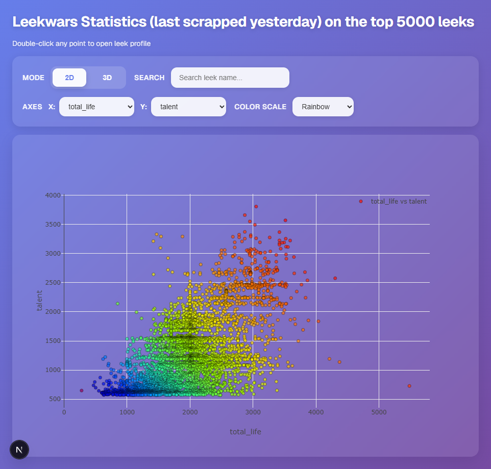
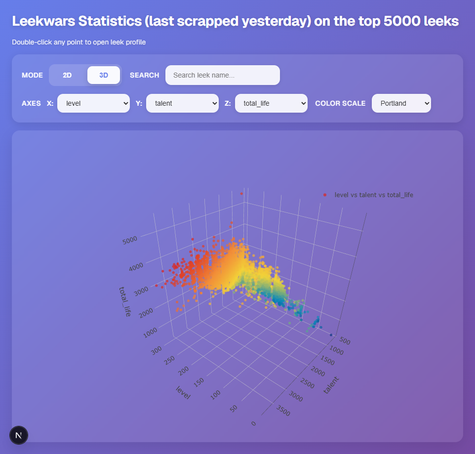

# LeekWars Statistics

An interactive data visualization platform for analyzing the top 5000 players of [LeekWars](https://leekwars.com), a programming game where you code artificial intelligence for vegetable warriors.

## 🎮 Features

### Interactive Visualizations

- **2D Plot Mode**: Visualize relationships between two player statistics
- **3D Plot Mode**: Explore three-dimensional correlations in player data
- **Dynamic Color Scales**: Multiple color gradients to highlight data patterns
- **Real-time Search**: Filter and highlight specific leeks by name

### Customizable Analysis

- Select from multiple player attributes (level, talent, stats, equipment, etc.)
- Choose different axes for X, Y, and Z coordinates
- Adjustable color scales (Rainbow, Viridis, Jet, and more)
- Logarithmic normalization for better data distribution

### Interactive Features

- **Double-click** any data point to open the player's LeekWars profile
- **Search highlighting**: Searched players appear larger with full opacity while others are dimmed
- **Smooth transitions**: Modern glassmorphic UI with smooth animations

## 📊 Visualization Modes

### 2D Mode



Analyze correlations between two statistics with scatter plots.

### 3D Mode



Explore three-dimensional relationships with interactive 3D scatter plots. Rotate, zoom, and pan to discover patterns.

## 🚀 Getting Started

### Prerequisites

- Node.js 18+
- npm or yarn

### Installation

```bash
# Clone the repository
git clone https://github.com/Bux42/LeekWars-Statistics.git

# Navigate to the app directory
cd LeekWars-Statistics/app

# Install dependencies
npm install

# Run the development server
npm run dev
```

Open [http://localhost:3000](http://localhost:3000) in your browser to see the application.

## 🛠️ Built With

- **Next.js** - React framework
- **TypeScript** - Type-safe development
- **Plotly.js** - Interactive charting library
- **React Plotly.js** - React wrapper for Plotly

## 📈 Available Statistics

The visualization includes the following player attributes:

- **Core Stats**: Level, Talent, XP, Ranking
- **Character Stats**: Life, Strength, Wisdom, Agility, Resistance, Science, Magic
- **Resources**: Frequency, Cores, RAM, TP, MP
- **Battle Stats**: Victories, Defeats, Draws, Win Ratio
- **Inventory**: Weapons, Chips, Components count
- **Code**: Lines of code

## 🎨 Color Scales

Multiple built-in color scales available:

- Rainbow
- Viridis
- Jet
- Portland
- And more...

## 📝 License

This project is open source and available under the MIT License.

## 🙏 Acknowledgments

- Data sourced from [LeekWars](https://leekwars.com)
- Top 5000 players as of the last scraping date (displayed on the page)

---

Made with 💜 by [Bux42](https://github.com/Bux42)
